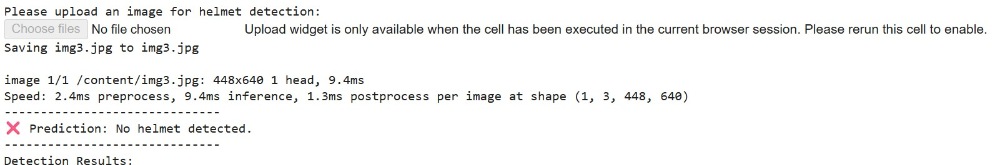

# 🪖 Helmet Detection System

A **Deep Learning–based Helmet Detection System** built using **YOLOv8 (Ultralytics)** and **OpenCV**, demonstrated through a **Google Colab live demo**. The system detects riders in images and identifies whether they are wearing a helmet, aiming to improve road safety and support smart traffic monitoring.

---

## 📌 Project Overview

Not wearing a helmet is one of the major causes of fatal injuries in road accidents. This project uses a **YOLOv8 object detection model** to:

* Detect persons and heads in an image
* Identify whether a detected rider is **with helmet** or **without helmet**
* Draw bounding boxes around detected objects
* Display clear text predictions in Colab

The system includes:

* A **YOLOv8-based detection model** (not simple image classification)
* **Live image upload and prediction inside Google Colab**
* Real-time detection output with bounding boxes and labels

---

## 🧠 Model Details

* **Base Model:** `yolov8n.pt` (YOLOv8 Nano — lightweight & fast)
* **Framework:** Ultralytics YOLOv8
* **Task:** Object Detection
* **Fine-tuned on:** Helmet detection dataset (Kaggle – Andrew MVD)
* **Final Trained Model:**

  ```
  runs/detect/helmet_model/weights/best.pt
  ```
* **What the model detects:**

  * Person
  * Head
  * Helmet / No Helmet

> 📌 Unlike a CNN classifier, this project performs **detection + classification in a single model** using YOLOv8.

---

## 📊 Dataset Structure

```
helmet_dataset/
├── train/
│   ├── helmet/
│   └── no_helmet/
└── test/
    ├── helmet/
    └── no_helmet/
```

### Class Distribution

| Split | Helmet | No Helmet |
| ----- | ------ | --------- |
| Train | 280    | 330       |
| Test  | 70     | 84        |

*(Train–test split created manually from the Kaggle dataset.)*

---

## 📸 Demo Screenshots

### Google Colab Live Demo



### Helmet Prediction Example

  

### No Helmet Prediction Example

  

---

## 🚀 How to Use (Colab Live Demo)

1. Open **Helmet_detection.ipynb** in **Google Colab**
2. Install dependencies and load `yolov8n.pt`
3. Fine-tune the model (or load `best.pt`)
4. Use the **Colab upload widget** to upload an image
5. The model will display:

   * Detected image with bounding boxes
   * Text output: **“Helmet detected” / “No helmet detected”**

> **Note:** If the trained model file is large, store it in Google Drive and load it in Colab.

---

## 📈 Results (Your Project – Colab Based)

* Successfully detects riders in most real-world images
* Works well in daylight and clear scenes
* Provides fast inference due to YOLOv8-n (nano) architecture
* Suitable for real-time or CCTV-style monitoring experiments

---

## ⚠️ Limitations

* Performance may drop in low light, blur, or crowded scenes
* Small helmets at long distances may be missed
* Intended for **educational and demonstration purposes only**

---

## 🧾 Technologies Used

* Python
* Ultralytics YOLOv8
* OpenCV
* Google Colab

---

## 👩‍💻 Author

**Iswarya Jasmine**
